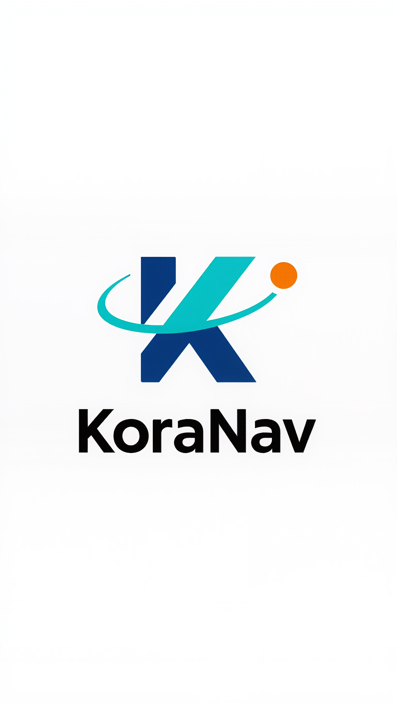

# KoraNav - Supply Chain Intelligence Platform

> An ultramodern marketing website for KoraNav, a digital supply chain and logistics innovation startup.



## 🚀 Overview

KoraNav is a next-generation supply chain intelligence platform featuring a sleek, Apple/Tesla-inspired design with dark mode aesthetics. The website showcases our flagship product **Severus-WMS** and provides comprehensive information about our mission to transform healthcare and enterprise logistics.

## ✨ Features

- **🎨 Modern Design**: Dark mode with teal, navy, and orange brand colors
- **📱 Fully Responsive**: Mobile-first design that looks great on all devices
- **🎭 Smooth Animations**: Framer Motion scroll-based reveals and interactions
- **📝 Contact Form**: Functional form with backend API integration
- **⚡ Fast Performance**: Built with Vite for optimal loading speeds
- **🔍 SEO Optimized**: Meta tags and Open Graph for better discoverability

## 🏗️ Tech Stack

### Frontend
- **React 18** - UI library
- **TypeScript** - Type safety
- **Tailwind CSS** - Styling
- **Framer Motion** - Animations
- **Wouter** - Client-side routing
- **TanStack Query** - Data fetching
- **Shadcn/ui** - Component library
- **Lucide React** - Icons

### Backend
- **Express.js** - Server framework
- **TypeScript** - Type safety
- **Zod** - Validation
- **In-memory storage** - Contact form submissions

### Build Tools
- **Vite** - Build tool and dev server
- **ESBuild** - JavaScript bundler
- **PostCSS** - CSS processing

## 📋 Prerequisites

- Node.js 20 or higher
- npm or yarn package manager

## 🛠️ Installation

```bash
# Install dependencies
npm install

# Start development server
npm run dev

# Build for production
npm run build:frontend

# Preview production build
npx vite preview --outDir dist/public
```

## 🌐 Deployment

See [DEPLOYMENT.md](DEPLOYMENT.md) for comprehensive deployment instructions including:

- Netlify deployment (static site)
- Replit Publishing (full-stack with working contact form)
- Netlify Functions setup (for contact form on Netlify)

### Quick Deploy to Netlify

1. Push code to GitHub
2. Connect repository to Netlify
3. Set build command: `npm run build:frontend`
4. Set publish directory: `dist/public`
5. Deploy!

**Note:** The contact form requires backend setup. See DEPLOYMENT.md for details.

## 📁 Project Structure

```
koranav-website/
├── client/                    # Frontend code
│   ├── src/
│   │   ├── components/       # React components
│   │   │   ├── Navigation.tsx
│   │   │   ├── HeroSection.tsx
│   │   │   ├── AboutSection.tsx
│   │   │   ├── ProductsSection.tsx
│   │   │   ├── FeaturesSection.tsx
│   │   │   ├── VisionSection.tsx
│   │   │   ├── ContactSection.tsx
│   │   │   └── Footer.tsx
│   │   ├── pages/            # Page components
│   │   ├── lib/              # Utilities
│   │   └── index.css         # Global styles
│   └── index.html            # HTML template
├── server/                    # Backend code
│   ├── index.ts              # Express server
│   ├── routes.ts             # API routes
│   └── storage.ts            # Data storage
├── shared/                    # Shared types
│   └── schema.ts             # Data models
├── attached_assets/           # Static assets
│   ├── IMG_7826_1761458161898.png  # Logo
│   └── IMG_7860_1761460607545.jpeg # Severus WMS image
├── design_guidelines.md       # Design system
├── netlify.toml              # Netlify config
├── DEPLOYMENT.md             # Deployment guide
└── package.json              # Dependencies
```

## 🎨 Design System

### Colors
- **Primary (Teal)**: `#2ab09e` - CTAs and brand accents
- **Secondary (Navy)**: `#2d3e50` - Section backgrounds
- **Accent (Orange)**: `#f97316` - Highlights and special CTAs
- **Background**: `#0f1419` - Dark mode base

### Typography
- **Headings**: Plus Jakarta Sans
- **Body**: Inter
- **Monospace**: Space Mono

### Spacing
- Consistent 8px grid system
- Small: 16px
- Medium: 32px
- Large: 64px

## 📄 Available Pages & Sections

1. **Hero** - Landing section with company mission
2. **About** - Company story and values
3. **Products** - Product showcase (Severus-WMS, Analytics, Connect)
4. **Features** - Key capabilities and benefits
5. **Vision** - Company vision and impact metrics
6. **Contact** - Contact form and information
7. **Footer** - Links and social media

## 🔧 Development

### Running Tests
```bash
# Type checking
npm run check

# End-to-end testing (using Playwright via Replit Agent)
# Already tested - contact form fully functional
```

### Adding New Sections

1. Create component in `client/src/components/`
2. Import in `client/src/pages/Home.tsx`
3. Add navigation link in `Navigation.tsx`
4. Update design guidelines if needed

### Modifying Design

Edit `client/src/index.css` for:
- Color variables
- Global styles
- Custom utility classes

## 🤝 Contributing

This is a proprietary project for KoraNav. For internal development:

1. Create a feature branch
2. Make your changes
3. Test thoroughly
4. Submit for review

## 📞 Contact

For questions about this project, contact the KoraNav development team.

## 📝 License

Proprietary - All rights reserved by KoraNav

---

**Built with ❤️ by the KoraNav Team**
